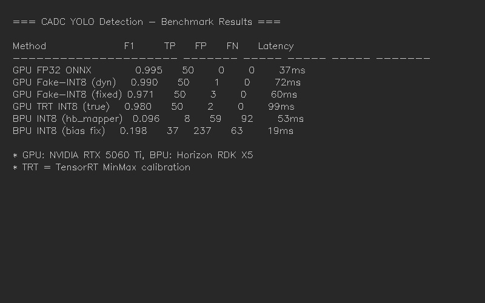
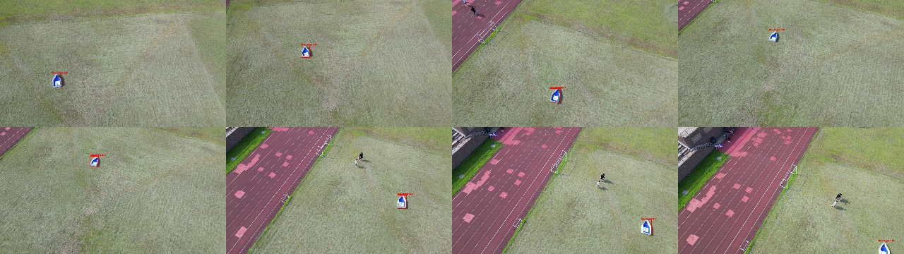
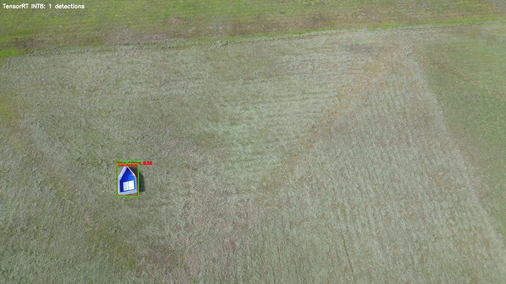
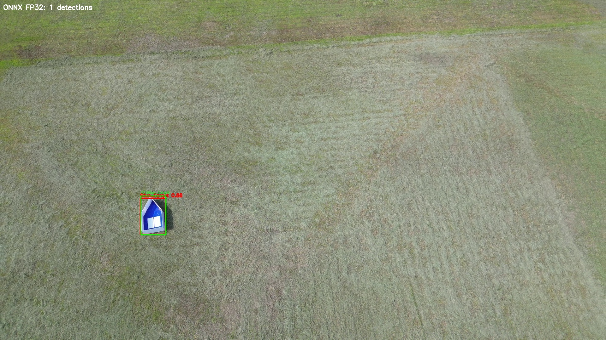
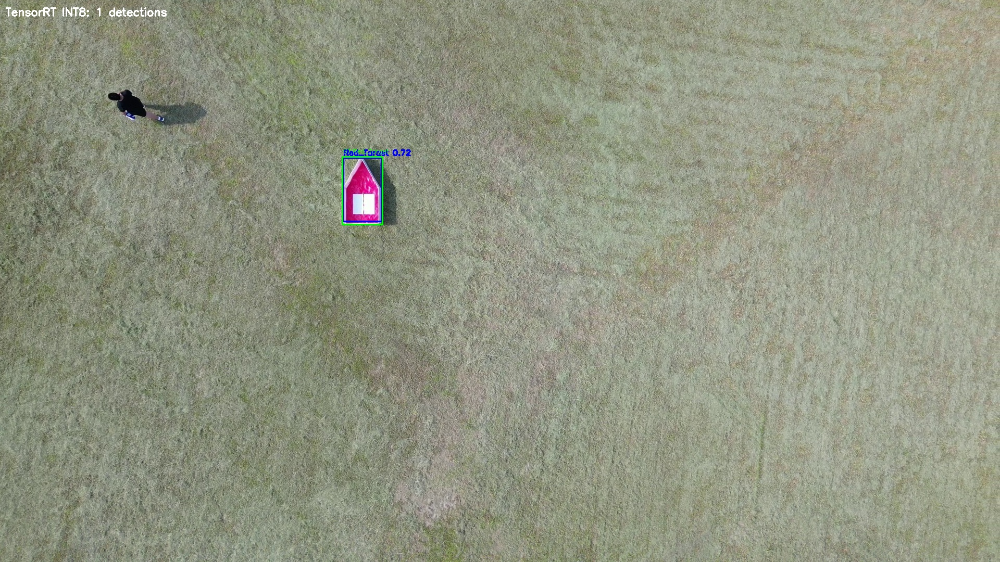
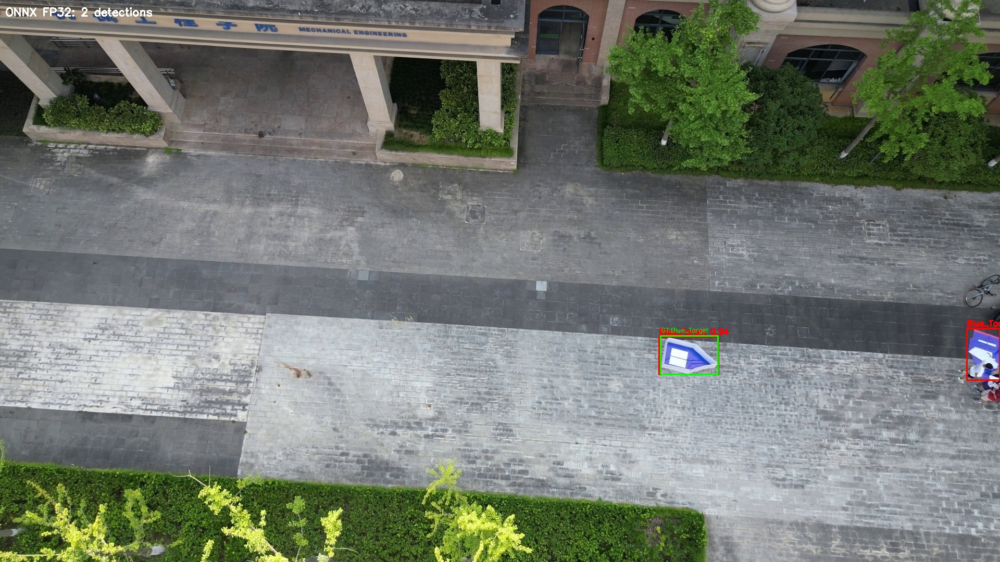
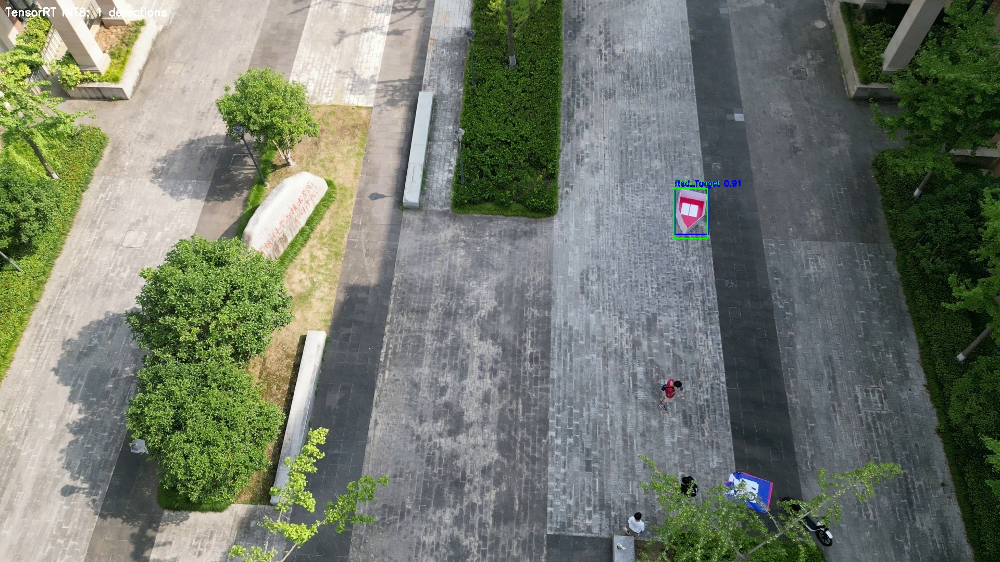

# CADC 对地侦察打击 — YOLO 目标识别

> 基于 YOLOv8n 的 2 类（Blue_Target / Red_Target）目标检测部署项目  
> 训练 GPU：NVIDIA RTX 5060 Ti · 部署目标：Horizon RDK X5 BPU

---

## 1. 项目结构

```
CADC_对地侦察打击_yolo识别/
├── README.md                          # 本文档
├── models/                            # 模型文件
│   ├── yolov8n_2cls_best.pt           # PyTorch FP32 训练权重（mAP50=0.995）
│   ├── yolov8n_2cls_nchw.onnx         # ONNX NCHW bbox-first 导出
│   ├── yolov8n_2cls_trt_int8.trt      # TensorRT INT8 Engine (MinMax校准)
│   ├── fixed_scales.pt                # 固定 scale 校准表（63层）
│   └── bpu/
│       ├── yolov8n_2cls_original_bpu.bin  # hb_mapper 原始编译
│       └── yolov8n_2cls_bias_neg3p5_bpu.bin # 优化偏置(-3.5)版本
├── train/
│   ├── train_2cls.py                  # YOLOv8n 2类训练脚本
│   └── dataset_target_2cls.yaml       # 数据集配置（1350训练/100验证）
├── inference/
│   ├── gpu_fp32/
│   │   └── eval_fp32.py               # GPU FP32 推理评测
│   ├── gpu_fake_quant/
│   │   └── eval_fake_quant.py         # GPU 假量化（固定/动态 scale）
│   ├── gpu_trt_int8/
│   │   └── trt_int8_eval.py           # TensorRT 真 INT8 推理评测
│   └── bpu_board/
│       ├── eval_bpu.py                # RDK X5 板端评测脚本
│       └── eval_max_original.py       # 原始板端评测
├── qat/
│   └── qat_train.py                   # QAT 量化感知训练
├── ptq/
│   ├── export_ptq.py                  # hb_mapper PTQ 编译脚本
│   ├── adjust_bias.py                 # 分类头偏置调整工具
│   └── scan_bias.py                   # 批量偏置扫描
├── results/
│   ├── panorama_trt_int8.jpg          # TensorRT INT8 全景推理结果
│   ├── benchmark_table.jpg            # 指标对比表格
│   └── *_trt_int8.jpg / *_onnx_fp32.jpg  # 单张检测结果
└── gen_results.py                     # 结果图生成脚本
```

---

## 2. 数据集

- **训练集**：1350 张 1920×1080 地面目标图像
- **验证集**：100 张
- **类别**：Blue_Target (60张) / Red_Target (40张)

---

## 3. 训练方法

| 参数 | 值 |
|------|-----|
| 模型 | YOLOv8n (3.0M 参数, 8.1 GFLOPs) |
| Epochs | 100 |
| Batch Size | 32 |
| 学习率 | lr0=0.01, lrf=0.01, cos_lr |
| Warmup | 3 epochs |
| Mosaic | 1.0, close at epoch 15 |
| 优化器 | AdamW (AMP) |

**训练命令**：
```bash
python train/train_2cls.py
```

**FP32 精度**：mAP50=0.995, mAP50-95=0.886

---

## 4. 推理结果

### 4.1 综合对比



| 方法 | F1 ↑ | TP | FP | FN | 延迟/张 |
|------|------|----|----|-----|---------|
| **GPU FP32 ONNX** | **0.995** | 50 | 0 | 0 | 37ms |
| GPU 假量化（动态 scale） | 0.990 | 50 | 1 | 0 | 72ms |
| GPU 假量化（固定 scale） | 0.971 | 50 | 3 | 0 | 60ms |
| **GPU TensorRT INT8（真量化）** | **0.980** | 50 | 2 | 0 | 99ms |
| BPU INT8（hb_mapper 原始） | 0.096 | 8 | 59 | 92 | 53ms |
| BPU INT8（偏置优化 -3.5） | 0.198 | 37 | 237 | 63 | 19ms |

### 4.2 TensorRT INT8 全景推理结果



### 4.3 单图对比（上：TensorRT INT8，下：FP32 ONNX）

#### 草地 Blue 目标

| TensorRT INT8 | FP32 ONNX |
|:---:|:---:|
|  |  |

#### 草地 Red 目标

|  |  |

#### 平地 Blue 目标

|  |  |

#### 平地 Red 目标

|  |  |

---

## 5. GPU 真 INT8 推理

### 5.1 原理

使用 NVIDIA TensorRT 的 **MinMax 校准器**（与 BPU hb_mapper `calibration_type: 'max'` 对齐），对 ONNX 模型做真正的 INT8 量化推理：

1. **校准阶段**：喂入校准图片，TensorRT 为每层计算激活量化 scale
2. **构建 Engine**：将 FP32 算子替换为 INT8 Kernel（跑在 GPU Tensor Cores 上）
3. **推理**：加载 Engine，输入 INT8 数据，输出 FP32 结果

### 5.2 运行

```bash
python inference/gpu_trt_int8/trt_int8_eval.py
```

### 5.3 关键发现

- **TensorRT 真 INT8（F1=0.98）接近 FP32（F1=0.995）**，证明 INT8 量化本身不会破坏检测精度
- **GPU 假量化固定 scale（F1=0.97）与真量化（F1=0.98）几乎一致**，说明 PyTorch `fake_quantize` 可以高保真模拟真 INT8
- **余弦相似度 0.999+ 完全不可信**——BPU 编译日志中所有输出余弦相似度都 >0.98，但实际 F1 只有 0.1

---

## 6. BPU 部署（RDK X5）

### 6.1 编译流程

```bash
# WSL 中运行
hb_mapper makertbin --config config.yaml --model-type onnx
```

配置文件模板见 `ptq/export_ptq.py`

### 6.2 板端评测

```bash
# 将 bin 文件传到板子
scp *.bin sunrise@192.168.128.10:/home/sunrise/yolo_deploy/

# SSH 到板子运行
python3 inference/bpu_board/eval_bpu.py <model.bin>
```

### 6.3 问题分析

BPU INT8 F1=0.10 的根本原因：**对称 INT8 量化（zero_point=0）丢失了分类 logits 的正向直流偏置**。

```
FP32 正常:  cls=[+5.0, +3.0, -10.0] → sigmoid → [0.99, 0.95, 0.00]
BPU INT8:   cls=[+0.2, -3.9, -11.2] → sigmoid → [0.55, 0.02, 0.00]
                                                ↑ 大量漏检
余弦相似度: 0.998（方向几乎不变，但幅值被压缩到接近零）
```

### 6.4 偏置优化实验

通过调整分类头 Conv 偏置值来补偿量化损失：

| 偏置 | F1 | TP | FP | 说明 |
|------|-----|----|-----|------|
| 原始 (-5~-8) | 0.096 | 8 | 59 | hb_mapper 默认 |
| -5.0 | 0.163 | 23 | 159 | |
| -4.0 | 0.196 | 33 | 203 | |
| **-3.5** | **0.198** | **37** | **237** | **最佳** |
| -2.5 | 0.185 | 50 | 390 | FP 激增 |
| 0.0 | 0.001 | 80 | 222K | 严重过检 |

---

## 7. 量化语义忠告

> **不要只信余弦相似度。**  
> 文献中常用余弦相似度评估量化后模型质量（值 >0.99 即认为无损），  
> 但本项目证明：余弦相似度 0.999 与 F1=0.1 可以共存。  
> 量化对检测模型的损害体现在 **logit 幅值压缩**，而非向量方向变化。  
> 评估 INT8 检测模型，必须用 **mAP / F1**，不能用余弦相似度。

---

## 8. 环境依赖

- Python 3.10
- PyTorch 2.11 + CUDA 13.0
- Ultralytics 8.4.54
- TensorRT 10.16
- ONNX Runtime 1.21
- pycuda
- hb_mapper 1.24.3 (WSL2 Ubuntu 22.04)

---

## 9. 引用

```
CADC 对地侦察打击 — YOLO 目标识别系统
YOLOv8n 2-Class Detection with INT8 Quantization Benchmark
GPU (TensorRT) vs BPU (Horizon RDK X5) Comparison
```
